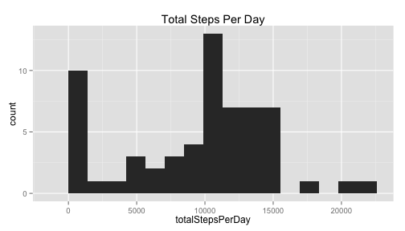
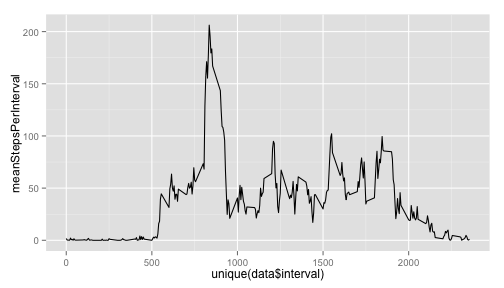
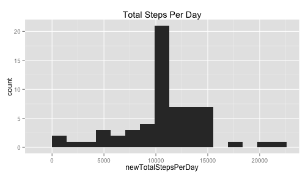
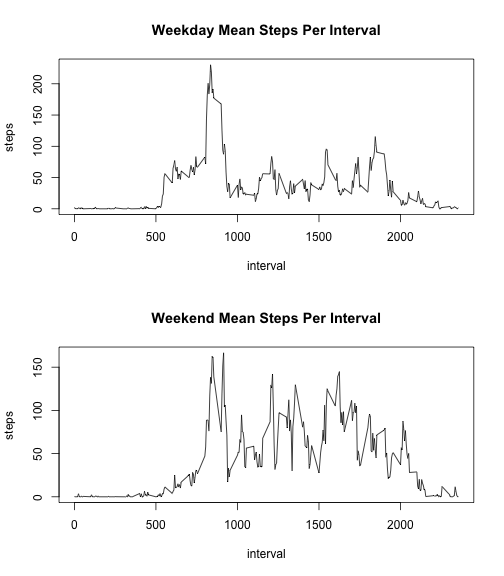

# Peer Assessment 1 Template

## Loading required packages

Load each of the required packages used for this peer assessment


```r
library(data.table)
library(dplyr)
library(ggplot2)
```

## Loading the preprocessing the data file

Move to the working data with the zip file. Unzip the file and then load the .csv file into the data table named 'data'


```r
unzip("repdata-data-activity.zip")
data <- fread("activity.csv", sep = ",")
data$date <- ymd(data$date)
```

## Mean, Median, and Total Number of Steps Taken Per Day

Calculate the total number of steps taken each day by splitting data by date and summing along steps. Store this value in the totalStepsPerDay variable. Create a histogram with the qplot function from ggplot2 package. Calculate mean and median for the total steps each day by taking the mean and median of the calculated total steps taken each day.


```r
totalStepsPerDay <- sapply(split(data$step, data$date), sum, na.rm = T)
qplot(totalStepsPerDay, main = "Total Steps Per Day", binwidth = range(totalStepsPerDay, na.rm = T)[2]/15)
```

 

```r
c("Mean:", mean(totalStepsPerDay))
```

```
## [1] "Mean:"            "9354.22950819672"
```

```r
c("Median:", median(totalStepsPerDay))
```

```
## [1] "Median:" "10395"
```

## 5 minute interval average total number of steps taken

Calculate and plot the total number of steps taken over each 5 minute interval averaged across all days. Find the


```r
meanStepsPerInterval <- sapply(split(data$step, data$interval), mean, na.rm = T)
qplot(unique(data$interval), meanStepsPerInterval, geom = "line")
```

 

```r
c("Interval with maximum mean steps:", unique(data$interval)[meanStepsPerInterval==max(meanStepsPerInterval)])
```

```
## [1] "Interval with maximum mean steps:" "835"
```

## Inputing missing values

Sum up the total number of NA entries and replace the NA entries with the mean value for the corresponding interval. Create a histogram with the new adjusted data set. Report the new mean and median.


```r
c("Total number of NA entries in the data set:", sum(is.na(data$steps)))
```

```
## [1] "Total number of NA entries in the data set:"
## [2] "2304"
```

```r
naIndex <- which(is.na(data$steps))
newData = data.table(data)
newData$steps[naIndex] = meanStepsPerInterval[as.character(data$interval[naIndex])]
newTotalStepsPerDay <- sapply(split(newData$step, newData$date), sum, na.rm = T)
qplot(newTotalStepsPerDay, main = "Total Steps Per Day", binwidth = range(newTotalStepsPerDay, na.rm = T)[2]/15)
```

 

```r
c("Mean number of steps per day:", mean(newTotalStepsPerDay))
```

```
## [1] "Mean number of steps per day:" "10766.1886792453"
```

```r
c("Median number of steps per day:", median(newTotalStepsPerDay))
```

```
## [1] "Median number of steps per day:" "10766.1886792453"
```

## Differences between weekends and weekdays

Here, we sort the step data into weekdays(MTWTF)/weekends(SS). We compare the mean level of steps taken over each interval to eachother.


```r
newData <- mutate(newData, dayType = weekdays(newData$date))
newData$dayType[newData$dayType != "Sunday" & newData$dayType != "Saturday"] <- c("Weekday")
newData$dayType[newData$dayType == "Sunday" | newData$dayType == "Saturday"] <- c("Weekend")
weekdayData <- newData[newData$dayType == "Weekday",]
weekendData <- newData[newData$dayType == "Weekend",]
meanStepsPerInterval <- sapply(split(weekdayData$step, weekdayData$interval), mean, na.rm = T)
meanWeekdayData <- data.table(as.numeric(names(meanStepsPerInterval)),meanStepsPerInterval)
setnames(meanWeekdayData, colnames(meanWeekdayData), c("interval", "steps"))
meanStepsPerInterval <- sapply(split(weekendData$step, weekendData$interval), mean, na.rm = T)
meanWeekendData <- data.table(as.numeric(names(meanStepsPerInterval)), meanStepsPerInterval)
setnames(meanWeekendData, colnames(meanWeekendData),c("interval", "steps"))
par(mfrow = c(2,1))
with(meanWeekdayData, plot(interval, steps, type = "l", main = "Weekday Mean Steps Per Interval"))
with(meanWeekendData, plot(interval, steps, type = "l", main = "Weekend Mean Steps Per Interval"))
```

 
